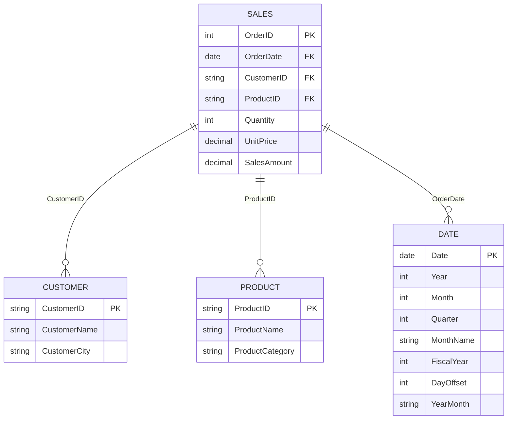

# Power BI Semantic Model Documentation

**Model Name:** BeforeCursorMCP Semantic Model  
**Version:** 1.0  
**Last Updated:** January 7, 2026  
**Author:** Auto-generated Documentation

---

## Table of Contents

1. [Executive Summary](#executive-summary)
2. [Data Model Overview](#data-model-overview)
3. [Table Relationships](#table-relationships)
4. [Tables & Columns](#tables--columns)
5. [Measures Documentation](#measures-documentation)
6. [Data Sources](#data-sources)
7. [Row-Level Security](#row-level-security)
8. [Usage Guidelines](#usage-guidelines)

---

## Executive Summary

This Power BI semantic model is designed for **Sales Analytics and Customer Insights**. It provides comprehensive tracking and analysis of:

- Sales transactions and revenue performance
- Customer behavior and retention metrics
- Product performance and catalog insights
- Time-based analysis with full time intelligence capabilities

The model contains **5 tables** (1 fact, 3 dimensions, 1 measures table), **3 relationships**, and **45 measures** organized across 6 functional categories.

### Key Features

✅ **Comprehensive Time Intelligence** - YTD, MTD, QTD, and prior period comparisons  
✅ **Growth Analytics** - Year-over-year, month-over-month, quarter-over-quarter tracking  
✅ **Customer Insights** - Retention rates, new vs. repeat customer analysis  
✅ **Advanced Analytics** - Running totals, rankings, moving averages, percentage calculations  
✅ **Self-Documenting** - All measures, columns, and tables include detailed descriptions

---

## Data Model Overview

### Model Architecture

The model follows a **star schema** design pattern with:

- **1 Fact Table**: Sales (transactional data)
- **3 Dimension Tables**: Customer, Product, Date
- **1 Measures Table**: _Measures (calculation hub)

### Table Summary

| Table | Type | Rows* | Columns | Measures | Purpose |
|-------|------|-------|---------|----------|---------|
| Sales | Fact | Variable | 7 | 0 | Transaction records |
| Customer | Dimension | Variable | 3 | 0 | Customer master data |
| Product | Dimension | Variable | 3 | 0 | Product catalog |
| Date | Dimension | ~730+ | 30 | 0 | Calendar/fiscal periods |
| _Measures | Calculated | 0 | 0 | 45 | Business calculations |

*Row counts are dynamic based on data refresh

---

## Table Relationships

### Relationship Diagram



### Relationship Details

| From Table | From Column | To Table | To Column | Cardinality | Cross Filter | Active |
|------------|-------------|----------|-----------|-------------|--------------|--------|
| Sales | CustomerID | Customer | CustomerID | Many-to-One | Single | ✅ |
| Sales | ProductID | Product | ProductID | Many-to-One | Single | ✅ |
| Sales | OrderDate | Date | Date | Many-to-One | Single | ✅ |

**Notes:**
- All relationships use **single-direction filtering** from dimension to fact
- The Date table is marked as a **Date Table** with the Date column as the key
- All relationships are **active** and used in calculations

---

## Tables & Columns

### 1. Sales Table (Fact)

**Description:** Fact table containing all sales transactions. Each row represents a single order line item with details about what was sold, when, to whom, quantity, price, and total amount. This is the primary table for revenue analysis and is the foundation of most business metrics. Links to Customer, Product, and Date dimension tables.

**Storage Mode:** Import

| Column | Data Type | Description |
|--------|-----------|-------------|
| **OrderID** | Integer | Unique identifier for each sales order. This is the primary key that distinguishes one order from another. Used to count distinct orders and link order details together. |
| **OrderDate** | Date | The date when the order was placed by the customer. This is the key date field used for all time-based analysis, filtering, and time intelligence calculations. Links to the Date table for calendar features. |
| **CustomerID** | Text | Foreign key linking to the Customer table. Identifies which customer placed this order. Used to aggregate sales by customer and analyze customer behavior patterns. |
| **ProductID** | Text | Foreign key linking to the Product table. Identifies which product was sold in this transaction. Used to analyze product performance and sales mix. |
| **Quantity** | Integer | Number of units of the product sold in this transaction. Always a whole number representing item count. Used to calculate total units sold and average quantities per order. |
| **UnitPrice** | Decimal | Price per single unit of the product at the time of sale. Represents the actual selling price which may differ from list price due to discounts or promotions. Used to calculate revenue and analyze pricing trends. |
| **SalesAmount** | Decimal | Total revenue for this transaction line, calculated as Quantity × UnitPrice. This is the primary revenue metric summed across all measures. Represents the actual dollars received from the sale. |

---

### 2. Customer Table (Dimension)

**Description:** Dimension table containing customer master data. Each row represents a unique customer with their identifying information and attributes. Used to analyze sales patterns by customer, identify top customers, segment by geography, and track customer behavior. Relates to the Sales table via CustomerID.

**Storage Mode:** Import

| Column | Data Type | Description |
|--------|-----------|-------------|
| **CustomerID** | Text | Unique identifier for each customer. This is the primary key of the Customer table and links to Sales table to connect customer attributes to transactions. Used for customer counting and segmentation. |
| **CustomerName** | Text | Full name of the customer. Used for displaying customer information in reports, identifying top customers, and creating customer-based visualizations. Should be used for user-facing reports rather than CustomerID. |
| **CustomerCity** | Text | City where the customer is located. Enables geographic analysis of sales, regional customer segmentation, and location-based marketing insights. Can be used to identify high-performing cities. |

---

### 3. Product Table (Dimension)

**Description:** Dimension table containing product catalog information. Each row represents a unique product with its name and category classification. Used for product performance analysis, category mix reporting, and inventory insights. Relates to the Sales table via ProductID to enable product-based analysis.

**Storage Mode:** Import

| Column | Data Type | Description |
|--------|-----------|-------------|
| **ProductID** | Text | Unique identifier for each product in the catalog. This is the primary key of the Product table and links to Sales table to connect product attributes to transactions. Used for product-level analysis and inventory tracking. |
| **ProductName** | Text | Display name of the product. This is the human-readable product identifier used in reports and visualizations. Use this column rather than ProductID when showing product information to end users. |
| **ProductCategory** | Text | Product classification or category group. Groups similar products together for category-level analysis, product mix reporting, and strategic planning. Useful for understanding which product lines drive revenue. |

---

### 4. Date Table (Dimension)

**Description:** Dimension table providing comprehensive date attributes for time-based analysis. Contains one row per calendar day with 30 columns covering calendar periods (year/month/day), fiscal periods, week calculations, offset fields for relative filtering, and formatted date labels. Essential for all time intelligence calculations and enables period-over-period comparisons. Relates to Sales table via OrderDate.

**Storage Mode:** Import  
**Date Range:** January 1, 2023 to Current Date

| Column | Data Type | Description |
|--------|-----------|-------------|
| **Date** | Date | Primary date column containing each individual calendar day. This is the key column used to relate the Date table to fact tables. All date-based filtering and time intelligence calculations rely on this column being properly marked as a date type. |
| **Year** | Integer | Four-digit year number (e.g., 2023, 2024). Extracted from the Date column using Date.Year function. Used for year-level aggregations, year-over-year comparisons, and filtering data by year. |
| **Month** | Integer | Month number from 1 (January) to 12 (December). Extracted from the Date column using Date.Month function. Used for month-level aggregations and creating month-based reports. Should be combined with Year for unique identification. |
| **Month Name** | Text | Full name of the month (January, February, etc.). Generated using Date.MonthName function. Provides user-friendly month labels for reports and should be sorted by Month number, not alphabetically. |
| **Quarter** | Integer | Quarter number from 1 to 4 representing calendar quarters (Q1=Jan-Mar, Q2=Apr-Jun, Q3=Jul-Sep, Q4=Oct-Dec). Calculated using Date.QuarterOfYear function. Essential for quarterly reporting and quarter-over-quarter analysis. |
| **Day** | Integer | Day of the month number from 1 to 31. Extracted from the Date column using Date.Day function. Used for day-level filtering and creating day-of-month analysis like sales by day number. |
| **Day Name** | Text | Full name of the day of the week (Monday, Tuesday, etc.). Generated using Date.DayOfWeekName function. Used for weekday analysis, identifying patterns by day name, and creating user-friendly reports. |
| **Day of Week** | Integer | Numeric day of the week where Monday=0, Tuesday=1, through Sunday=6 (based on firstDayofWeek setting). Calculated using Date.DayOfWeek function. Useful for sorting weekdays correctly and weekday-based aggregations. |
| **Day of Year** | Integer | Sequential day number within the year from 1 to 365 (or 366 in leap years). Calculated using Date.DayOfYear function. Useful for year-over-year same-day comparisons and seasonal analysis. |
| **Week of Year** | Integer | Week number within the year from 1 to 52/53. Calculated using Date.WeekOfYear function based on the firstDayofWeek setting. Used for weekly trending and week-over-week comparisons. |
| **Week of Month** | Integer | Week number within the month from 1 to 5. Calculated using Date.WeekOfMonth function. Helps identify which week of the month a date falls into for intra-month pattern analysis. |
| **Fiscal Year** | Integer | Fiscal year number adjusted based on the fiscal year start month (configured as month 7/July). Calculated by shifting dates forward by the fiscal adjustment period before extracting the year. Used when business reporting follows a non-calendar fiscal year. |
| **Fiscal Quarter** | Integer | Fiscal quarter number (1-4) adjusted for the fiscal year calendar. Calculated after applying the fiscal month offset to align with company's fiscal year structure. Use this instead of calendar Quarter for fiscal reporting. |
| **Fiscal Month** | Integer | Fiscal month number adjusted for the fiscal year calendar. Calculated after applying the fiscal month offset to align quarters and months with the fiscal year start. Essential for fiscal period-based analysis. |
| **Day Offset** | Integer | Number of days between each date and today's date. Negative values are past dates (e.g., -30 = 30 days ago), positive values are future dates. Calculated as Date - Today. Useful for relative date filtering like 'Last 30 Days' or 'Next 7 Days'. |
| **Month Offset** | Integer | Number of months between each date and the current month. Negative values are past months (e.g., -3 = 3 months ago), zero is current month, positive values are future months. Calculated as (Year-CurrentYear)*12 + (Month-CurrentMonth). Essential for relative period filtering. |
| **Year Offset** | Integer | Number of years between each date and the current year. Negative values are past years (e.g., -1 = last year), zero is current year, positive values are future years. Calculated as Year - CurrentYear. Used for dynamic year filtering like 'Last Year' or 'Current Year'. |
| **Quarter Offset** | Integer | Number of quarters between each date and the current quarter. Negative values are past quarters (e.g., -2 = 2 quarters ago), zero is current quarter. Calculated as (Year-CurrentYear)*4 + (Quarter-CurrentQuarter). Enables relative quarter filtering like 'Last 4 Quarters'. |
| **Year-Month** | Text | Human-readable year-month label formatted as 'MMM yyyy' (e.g., 'Jan 2024', 'Feb 2024'). Created using Date.ToText function. Provides user-friendly month labels that combine month name and year for reports and axes labels. |
| **Year-Month Code** | Integer | Numeric year-month code in YYYYMM format (e.g., 202401 for January 2024). Created using Date.ToText function. Useful for sorting months chronologically and creating unique month identifiers that sort correctly. |
| **Start of Year** | Date | The first day of the year (January 1st) for each date. Calculated using Date.StartOfYear function. Useful for creating year-to-date calculations and identifying year boundaries in visualizations. |
| **End of Year** | Date | The last day of the year (December 31st) for each date. Calculated using Date.EndOfYear function. Used for year-end analysis and determining if a date falls at year boundaries. |
| **Start of Month** | Date | The first day of the month for each date. Calculated using Date.StartOfMonth function. Essential for month-to-date calculations and identifying month boundaries in time series analysis. |
| **End of Month** | Date | The last day of the month for each date. Calculated using Date.EndOfMonth function. Used for end-of-month analysis and determining the number of days remaining in a month. |
| **Days in Month** | Integer | Total number of days in the month (28-31 depending on month and leap year). Calculated using Date.DaysInMonth function. Useful for daily average calculations and understanding month length variations. |
| **Start of Quarter** | Date | The first day of the quarter for each date. Calculated using Date.StartOfQuarter function. Used for quarter-to-date calculations and identifying quarter boundaries in reports. |
| **End of Quarter** | Date | The last day of the quarter for each date. Calculated using Date.EndOfQuarter function. Useful for end-of-quarter analysis and determining quarter completion status. |
| **Start of Week** | Date | The first day of the week (typically Monday) for each date. Calculated using Date.StartOfWeek function. Essential for week-to-date calculations and creating weekly aggregations. |
| **End of Week** | Date | The last day of the week (typically Sunday) for each date. Calculated using Date.EndOfWeek function. Used for end-of-week reporting and determining if a date is at week boundaries. |
| **Date Equalizer** | Text | Special comparison date that shifts dates back by one year if they're older than 2 years from today. Returns the original date if within last year, adds 365 days if 1-2 years old, null if older. Used for year-over-year comparisons that align dates across years. |

---

### 5. _Measures Table (Calculated)

**Description:** Central hub for business intelligence - contains 45 measures across sales, customer, and product analytics with comprehensive time intelligence.

**Storage Mode:** Import (Calculated Table)  
**Contains:** 45 DAX Measures organized in 6 categories

This table exists solely to house calculated measures and contains no data columns. See the [Measures Documentation](#measures-documentation) section for detailed information on each measure.

---

## Measures Documentation

### Overview

The model contains **45 measures** organized into **6 functional categories**:

1. **Core Metrics** (5 measures) - Foundation KPIs
2. **Customer Analytics** (8 measures) - Customer behavior and retention
3. **Product Performance** (3 measures) - Product sales analysis
4. **Time Intelligence** (12 measures) - Period-over-period comparisons
5. **Growth & Variance** (12 measures) - Growth tracking and trends
6. **Advanced Analytics** (5 measures) - Rankings, percentages, and statistical analysis

---

### Core Metrics

#### Total Sales

**Business Logic:** Calculates the total revenue from all sales transactions. This is the foundation metric for most revenue analysis.

**DAX Code:**
```dax
Total Sales = SUM(Sales[SalesAmount])
```

**Format:** Currency ($#,0.00)  
**Category:** Core Metrics

---

#### Total Quantity

**Business Logic:** Counts the total number of product units sold across all transactions. Useful for understanding sales volume independent of price.

**DAX Code:**
```dax
Total Quantity = SUM(Sales[Quantity])
```

**Format:** Number (#,0)  
**Category:** Core Metrics

---

#### Total Orders

**Business Logic:** Counts the number of unique orders placed. Essential for calculating average order metrics.

**DAX Code:**
```dax
Total Orders = DISTINCTCOUNT(Sales[OrderID])
```

**Format:** Number (#,0)  
**Category:** Core Metrics

---

#### Average Order Value

**Business Logic:** Calculates the average revenue per order. Key metric for understanding customer purchasing behavior.

**DAX Code:**
```dax
Average Order Value = DIVIDE([Total Sales], [Total Orders], 0)
```

**Format:** Currency ($#,0.00)  
**Category:** Core Metrics

---

#### Average Unit Price

**Business Logic:** Calculates the average price per unit sold across all transactions. Helps identify pricing trends and product mix effects.

**DAX Code:**
```dax
Average Unit Price = AVERAGE(Sales[UnitPrice])
```

**Format:** Currency ($#,0.00)  
**Category:** Core Metrics

---

### Customer Analytics

#### Total Customers

**Business Logic:** Counts the number of unique customers who made at least one purchase. Essential for customer segmentation and lifetime value analysis.

**DAX Code:**
```dax
Total Customers = DISTINCTCOUNT(Sales[CustomerID])
```

**Format:** Number (#,0)  
**Category:** Customer Analytics

---

#### Sales per Customer

**Business Logic:** Calculates average revenue per customer. Indicates customer lifetime value and purchasing power.

**DAX Code:**
```dax
Sales per Customer = DIVIDE([Total Sales], [Total Customers], 0)
```

**Format:** Currency ($#,0.00)  
**Category:** Customer Analytics

---

#### Orders per Customer

**Business Logic:** Measures purchase frequency. Shows how often customers return to make purchases - higher values indicate better customer loyalty.

**DAX Code:**
```dax
Orders per Customer = DIVIDE([Total Orders], [Total Customers], 0)
```

**Format:** Number (#,0.0)  
**Category:** Customer Analytics

---

#### Customer Retention Rate

**Business Logic:** Measures what percentage of prior year customers made purchases again in the current period. High retention indicates strong customer loyalty.

**DAX Code:**
```dax
Customer Retention Rate = 
VAR CurrentCustomers = [Total Customers]
VAR PYCustomers = CALCULATE([Total Customers], SAMEPERIODLASTYEAR('Date'[Date]))
VAR RepeatCustomers = CALCULATE(
    DISTINCTCOUNT(Sales[CustomerID]),
    FILTER(
        ALL('Date'),
        'Date'[Date] >= MIN('Date'[Date]) && 'Date'[Date] <= MAX('Date'[Date])
    ),
    FILTER(
        ALL(Sales),
        COUNTROWS(
            FILTER(
                ALL(Sales),
                EARLIER(Sales[CustomerID]) = Sales[CustomerID] &&
                Sales[OrderDate] < MIN('Date'[Date])
            )
        ) > 0
    )
)
RETURN DIVIDE(RepeatCustomers, PYCustomers, 0)
```

**Format:** Percentage (0.0%)  
**Category:** Customer Analytics

---

#### New Customers

**Business Logic:** Counts customers making their very first purchase during the selected period. Critical for measuring customer acquisition.

**DAX Code:**
```dax
New Customers = 
VAR FirstPurchaseDates = SUMMARIZE(Sales, Sales[CustomerID], "FirstPurchase", MIN(Sales[OrderDate]))
RETURN CALCULATE(
    DISTINCTCOUNT(Sales[CustomerID]),
    FILTER(FirstPurchaseDates, [FirstPurchase] >= MIN('Date'[Date]) && [FirstPurchase] <= MAX('Date'[Date]))
)
```

**Format:** Number (#,0)  
**Category:** Customer Analytics

---

#### Repeat Customers

**Business Logic:** Counts customers who made purchases in the current period AND had at least one purchase before the period started. Indicates successful customer retention and loyalty.

**DAX Code:**
```dax
Repeat Customers = 
VAR CurrentPeriod = VALUES('Date'[Date])
RETURN CALCULATE(
    DISTINCTCOUNT(Sales[CustomerID]),
    FILTER(
        Sales,
        CALCULATE(
            COUNTROWS(Sales),
            ALL('Date'),
            Sales[OrderDate] < MIN(CurrentPeriod)
        ) > 0
    )
)
```

**Format:** Number (#,0)  
**Category:** Customer Analytics

---

#### Top Customer

**Business Logic:** Returns the name of the customer with the highest Total Sales in the current context. Highlights your most valuable customer in any filtered context.

**DAX Code:**
```dax
Top Customer = 
VAR TopCust = TOPN(1, ALL(Customer[CustomerName]), [Total Sales], DESC)
RETURN CONCATENATEX(TopCust, Customer[CustomerName], ", ")
```

**Format:** Text  
**Category:** Customer Analytics

---

### Product Performance

#### Total Products Sold

**Business Logic:** Counts the number of distinct products that have been sold at least once. Useful for assessing product portfolio performance and catalog utilization.

**DAX Code:**
```dax
Total Products Sold = DISTINCTCOUNT(Sales[ProductID])
```

**Format:** Number (#,0)  
**Category:** Product Performance

---

#### Sales per Product

**Business Logic:** Calculates average revenue per product. Helps identify if revenue is concentrated in few products or spread across many.

**DAX Code:**
```dax
Sales per Product = DIVIDE([Total Sales], [Total Products Sold], 0)
```

**Format:** Currency ($#,0.00)  
**Category:** Product Performance

---

#### Best Selling Product

**Business Logic:** Returns the name of the product with the highest Total Sales in the current context. Useful for KPI cards and summary dashboards.

**DAX Code:**
```dax
Best Selling Product = 
VAR TopProduct = TOPN(1, ALL(Product[ProductName]), [Total Sales], DESC)
RETURN CONCATENATEX(TopProduct, Product[ProductName], ", ")
```

**Format:** Text  
**Category:** Product Performance

---

### Time Intelligence

#### Sales YTD

**Business Logic:** Calculates year-to-date sales from January 1st through the current date filter. Resets each January 1st.

**DAX Code:**
```dax
Sales YTD = TOTALYTD([Total Sales], 'Date'[Date])
```

**Format:** Currency ($#,0.00)  
**Category:** Time Intelligence \ Year-to-Date

---

#### Sales MTD

**Business Logic:** Calculates month-to-date sales from the 1st of the month through the current date filter. Resets on the 1st of each month.

**DAX Code:**
```dax
Sales MTD = TOTALMTD([Total Sales], 'Date'[Date])
```

**Format:** Currency ($#,0.00)  
**Category:** Time Intelligence \ Month-to-Date

---

#### Sales QTD

**Business Logic:** Calculates quarter-to-date sales from the start of the quarter through the current date filter. Resets at the beginning of each quarter.

**DAX Code:**
```dax
Sales QTD = TOTALQTD([Total Sales], 'Date'[Date])
```

**Format:** Currency ($#,0.00)  
**Category:** Time Intelligence \ Quarter-to-Date

---

#### Sales Last Year

**Business Logic:** Shifts the current date filter back exactly one year and calculates Total Sales for that period. Essential for year-over-year comparisons.

**DAX Code:**
```dax
Sales Last Year = CALCULATE([Total Sales], SAMEPERIODLASTYEAR('Date'[Date]))
```

**Format:** Currency ($#,0.00)  
**Category:** Time Intelligence \ Prior Year

---

#### Sales Last Month

**Business Logic:** Shifts the date filter back one month and calculates Total Sales. Useful for month-over-month trend analysis and sequential comparisons.

**DAX Code:**
```dax
Sales Last Month = CALCULATE([Total Sales], DATEADD('Date'[Date], -1, MONTH))
```

**Format:** Currency ($#,0.00)  
**Category:** Time Intelligence \ Prior Month

---

#### Sales Last Quarter

**Business Logic:** Shifts the date filter back one quarter (3 months) and calculates Total Sales. Enables quarter-over-quarter performance tracking.

**DAX Code:**
```dax
Sales Last Quarter = CALCULATE([Total Sales], DATEADD('Date'[Date], -1, QUARTER))
```

**Format:** Currency ($#,0.00)  
**Category:** Time Intelligence \ Prior Quarter

---

#### Sales PY YTD

**Business Logic:** Calculates year-to-date sales for the same period in the prior year. Critical for understanding year-over-year progress.

**DAX Code:**
```dax
Sales PY YTD = CALCULATE([Sales YTD], SAMEPERIODLASTYEAR('Date'[Date]))
```

**Format:** Currency ($#,0.00)  
**Category:** Time Intelligence \ Prior Year

---

#### Sales PY MTD

**Business Logic:** Calculates month-to-date sales for the same period in the prior year. Helps identify monthly performance patterns.

**DAX Code:**
```dax
Sales PY MTD = CALCULATE([Sales MTD], SAMEPERIODLASTYEAR('Date'[Date]))
```

**Format:** Currency ($#,0.00)  
**Category:** Time Intelligence \ Prior Month

---

#### Sales PY QTD

**Business Logic:** Calculates quarter-to-date sales for the same period in the prior year. Essential for seasonal business analysis.

**DAX Code:**
```dax
Sales PY QTD = CALCULATE([Sales QTD], SAMEPERIODLASTYEAR('Date'[Date]))
```

**Format:** Currency ($#,0.00)  
**Category:** Time Intelligence \ Prior Quarter

---

#### Orders YTD

**Business Logic:** Counts total unique orders from January 1st through the current date filter. Helps track order volume trends throughout the year.

**DAX Code:**
```dax
Orders YTD = TOTALYTD([Total Orders], 'Date'[Date])
```

**Format:** Number (#,0)  
**Category:** Time Intelligence \ Year-to-Date

---

#### Orders MTD

**Business Logic:** Counts total unique orders from the 1st of the month through the current date filter. Useful for monitoring current month performance.

**DAX Code:**
```dax
Orders MTD = TOTALMTD([Total Orders], 'Date'[Date])
```

**Format:** Number (#,0)  
**Category:** Time Intelligence \ Month-to-Date

---

#### Orders QTD

**Business Logic:** Counts total unique orders from the quarter start through the current date filter. Important for quarterly business reviews.

**DAX Code:**
```dax
Orders QTD = TOTALQTD([Total Orders], 'Date'[Date])
```

**Format:** Number (#,0)  
**Category:** Time Intelligence \ Quarter-to-Date

---

### Growth & Variance

#### Sales YoY Growth

**Business Logic:** Calculates the dollar difference between current period sales and same period last year. Positive values indicate growth, negative indicate decline.

**DAX Code:**
```dax
Sales YoY Growth = [Total Sales] - [Sales Last Year]
```

**Format:** Currency ($#,0.00)  
**Category:** Growth & Variance \ Year-over-Year

---

#### Sales YoY Growth %

**Business Logic:** Calculates year-over-year sales growth as a percentage. 0.25 = 25% growth, -0.10 = 10% decline.

**DAX Code:**
```dax
Sales YoY Growth % = DIVIDE([Total Sales] - [Sales Last Year], [Sales Last Year], 0)
```

**Format:** Percentage (0.0%)  
**Category:** Growth & Variance \ Year-over-Year

---

#### Sales MoM Growth

**Business Logic:** Calculates the dollar difference between current month and previous month sales. Useful for identifying short-term trends and momentum.

**DAX Code:**
```dax
Sales MoM Growth = [Total Sales] - [Sales Last Month]
```

**Format:** Currency ($#,0.00)  
**Category:** Growth & Variance \ Month-over-Month

---

#### Sales MoM Growth %

**Business Logic:** Calculates month-over-month sales growth as a percentage. Helps identify acceleration or deceleration in sales trends.

**DAX Code:**
```dax
Sales MoM Growth % = DIVIDE([Total Sales] - [Sales Last Month], [Sales Last Month], 0)
```

**Format:** Percentage (0.0%)  
**Category:** Growth & Variance \ Month-over-Month

---

#### Sales QoQ Growth

**Business Logic:** Calculates the dollar difference between current quarter and previous quarter sales. Important for quarterly business planning and investor reporting.

**DAX Code:**
```dax
Sales QoQ Growth = [Total Sales] - [Sales Last Quarter]
```

**Format:** Currency ($#,0.00)  
**Category:** Growth & Variance \ Quarter-over-Quarter

---

#### Sales QoQ Growth %

**Business Logic:** Calculates quarter-over-quarter sales growth as a percentage. Key metric for quarterly business reviews.

**DAX Code:**
```dax
Sales QoQ Growth % = DIVIDE([Total Sales] - [Sales Last Quarter], [Sales Last Quarter], 0)
```

**Format:** Percentage (0.0%)  
**Category:** Growth & Variance \ Quarter-over-Quarter

---

#### Sales YTD vs PY YTD

**Business Logic:** Compares current year-to-date performance against prior year's YTD at the same point in time. Shows if you're ahead or behind last year's pace in dollar terms.

**DAX Code:**
```dax
Sales YTD vs PY YTD = [Sales YTD] - [Sales PY YTD]
```

**Format:** Currency ($#,0.00)  
**Category:** Growth & Variance \ YTD Comparisons

---

#### Sales YTD vs PY YTD %

**Business Logic:** Shows year-to-date performance as a percentage compared to prior year YTD. Answers 'Are we X% ahead or behind last year's pace?' Critical for annual planning.

**DAX Code:**
```dax
Sales YTD vs PY YTD % = DIVIDE([Sales YTD] - [Sales PY YTD], [Sales PY YTD], 0)
```

**Format:** Percentage (0.0%)  
**Category:** Growth & Variance \ YTD Comparisons

---

#### Sales MTD vs PY MTD

**Business Logic:** Compares current month-to-date performance against the same period in prior year's month. Helps identify if monthly trends are improving year-over-year.

**DAX Code:**
```dax
Sales MTD vs PY MTD = [Sales MTD] - [Sales PY MTD]
```

**Format:** Currency ($#,0.00)  
**Category:** Growth & Variance \ MTD Comparisons

---

#### Sales MTD vs PY MTD %

**Business Logic:** Shows month-to-date performance as a percentage compared to prior year's MTD. Useful for forecasting final month results based on current trajectory.

**DAX Code:**
```dax
Sales MTD vs PY MTD % = DIVIDE([Sales MTD] - [Sales PY MTD], [Sales PY MTD], 0)
```

**Format:** Percentage (0.0%)  
**Category:** Growth & Variance \ MTD Comparisons

---

#### Orders YoY Growth %

**Business Logic:** Measures year-over-year change in order volume as a percentage. Shows if customer transaction volume is growing or declining annually.

**DAX Code:**
```dax
Orders YoY Growth % = 
VAR OrdersPY = CALCULATE([Total Orders], SAMEPERIODLASTYEAR('Date'[Date]))
RETURN DIVIDE([Total Orders] - OrdersPY, OrdersPY, 0)
```

**Format:** Percentage (0.0%)  
**Category:** Growth & Variance \ Year-over-Year

---

#### AOV YoY Growth %

**Business Logic:** Tracks year-over-year change in Average Order Value as a percentage. Indicates if customers are spending more or less per transaction over time.

**DAX Code:**
```dax
AOV YoY Growth % = 
VAR AOVPY = CALCULATE([Average Order Value], SAMEPERIODLASTYEAR('Date'[Date]))
RETURN DIVIDE([Average Order Value] - AOVPY, AOVPY, 0)
```

**Format:** Percentage (0.0%)  
**Category:** Growth & Variance \ Year-over-Year

---

### Advanced Analytics

#### Running Total Sales

**Business Logic:** Calculates cumulative sales from the earliest date in the model up to the current date filter. Creates a progressive total that never decreases.

**DAX Code:**
```dax
Running Total Sales = CALCULATE([Total Sales], FILTER(ALL('Date'), 'Date'[Date] <= MAX('Date'[Date])))
```

**Format:** Currency ($#,0.00)  
**Category:** Advanced Analytics \ Running Totals

---

#### Sales Rank by Product

**Business Logic:** Ranks products by their sales performance, with 1 being the highest selling product. Shows where each product stands in the sales hierarchy.

**DAX Code:**
```dax
Sales Rank by Product = RANKX(ALL(Product[ProductName]), [Total Sales], , DESC, DENSE)
```

**Format:** Number (#,0)  
**Category:** Advanced Analytics \ Rankings

---

#### Sales Rank by Customer

**Business Logic:** Ranks customers by their total purchase amount, with 1 being the top customer. Helps identify VIP customers and segment by spending level.

**DAX Code:**
```dax
Sales Rank by Customer = RANKX(ALL(Customer[CustomerName]), [Total Sales], , DESC, DENSE)
```

**Format:** Number (#,0)  
**Category:** Advanced Analytics \ Rankings

---

#### % of Total Sales

**Business Logic:** Calculates what percentage of total company sales the current context represents. For example, if Product A shows 0.15, it means Product A represents 15% of all sales.

**DAX Code:**
```dax
% of Total Sales = DIVIDE([Total Sales], CALCULATE([Total Sales], ALL()), 0)
```

**Format:** Percentage (0.0%)  
**Category:** Advanced Analytics \ Percentages

---

#### % of Category Sales

**Business Logic:** Shows what percentage of sales within a product category the current context represents. Helps understand product mix within categories.

**DAX Code:**
```dax
% of Category Sales = DIVIDE([Total Sales], CALCULATE([Total Sales], ALLEXCEPT(Product, Product[ProductCategory])), 0)
```

**Format:** Percentage (0.0%)  
**Category:** Advanced Analytics \ Percentages

---

#### Sales 3 Month Moving Average

**Business Logic:** Smooths sales trends by averaging the last 3 months of data at any point in time. Reduces volatility and shows underlying trends more clearly.

**DAX Code:**
```dax
Sales 3 Month Moving Average = AVERAGEX(DATESINPERIOD('Date'[Date], LASTDATE('Date'[Date]), -3, MONTH), [Total Sales])
```

**Format:** Currency ($#,0.00)  
**Category:** Advanced Analytics \ Moving Averages

---

## Data Sources

### Power Query Configuration

The model uses **Power Query (M language)** for data transformation and loading. All tables are configured for **Import** storage mode.

---

### Sales Table Source

**Source Type:** Power Query (M Expression)  
**Referenced Query:** `SalesData`

**Transformation Steps:**

```m
let
    Source = SalesData,
    #"Removed Other Columns" = Table.SelectColumns(Source,{"OrderID", "OrderDate", "CustomerID", "ProductID", "Quantity", "UnitPrice", "SalesAmount"}),
    #"Changed Type" = Table.TransformColumnTypes(#"Removed Other Columns",{{"SalesAmount", type number}, {"UnitPrice", type number}, {"OrderDate", type date}})
in
    #"Changed Type"
```

**Summary:**
1. References a base query named `SalesData`
2. Selects only the 7 required columns from the source
3. Ensures proper data types for numeric and date fields

---

### Customer Table Source

**Source Type:** Power Query (M Expression)  
**Referenced Query:** `SalesData`

**Transformation Steps:**

```m
let
    Source = SalesData,
    #"Removed Other Columns" = Table.SelectColumns(Source,{"CustomerID", "CustomerName", "CustomerCity"}),
    #"Removed Duplicates" = Table.Distinct(#"Removed Other Columns", {"CustomerID"})
in
    #"Removed Duplicates"
```

**Summary:**
1. References the same base query `SalesData`
2. Selects customer-related columns
3. Removes duplicate customers using CustomerID as the unique key

---

### Product Table Source

**Source Type:** Power Query (M Expression)  
**Referenced Query:** `SalesData`

**Transformation Steps:**

```m
let
    Source = SalesData,
    #"Removed Other Columns" = Table.SelectColumns(Source,{"ProductID", "ProductName", "ProductCategory"}),
    #"Removed Duplicates" = Table.Distinct(#"Removed Other Columns", {"ProductID"})
in
    #"Removed Duplicates"
```

**Summary:**
1. References the same base query `SalesData`
2. Selects product-related columns
3. Removes duplicate products using ProductID as the unique key

---

### Date Table Source

**Source Type:** Power Query (M Expression) - **Generated Date Table**  
**Date Range:** January 1, 2023 to Current Date

**Configuration:**
- **Start Year:** 2023
- **End Date:** Current Date (dynamic)
- **Fiscal Year Start:** July (Month 7)
- **Week Start Day:** Monday

**Transformation Steps:** *(Condensed - see full code below)*

```m
let
    // Configurations
    Today = Date.From(DateTime.LocalNow()),
    FromYear = 2023,
    ToYear = Date.Year(Today),
    StartofFiscalYear = 7,
    firstDayofWeek = Day.Monday,
    
    // Generate date list
    FromDate = #date(FromYear,1,1),
    ToDate = Today,
    Source = List.Dates(FromDate, Duration.Days(ToDate-FromDate)+1, #duration(1,0,0,0)),
    
    // Transform to table and add all calendar attributes
    #"Converted to Table" = Table.FromList(Source, Splitter.SplitByNothing(), null, null, ExtraValues.Error),
    #"Renamed Columns" = Table.RenameColumns(#"Converted to Table",{{"Column1", "Date"}}),
    
    // Add Year, Month, Day, Quarter columns
    #"Inserted Year" = Table.AddColumn(#"Renamed Columns", "Year", each Date.Year([Date]), Int64.Type),
    #"Inserted Month" = Table.AddColumn(...),
    #"Inserted Quarter" = Table.AddColumn(...),
    
    // Add fiscal period calculations
    FiscalMonthBaseIndex = 13-StartofFiscalYear,
    adjustedFiscalMonthBaseIndex = if(FiscalMonthBaseIndex>=12 or FiscalMonthBaseIndex<0) then 0 else FiscalMonthBaseIndex,
    #"Added Fiscal Base Date" = Table.AddColumn(...),
    
    // Add offset columns for relative filtering
    #"Inserted Age" = Table.AddColumn(..., "Age", each [Date]-Today, type duration),
    #"Renamed Day Offset" = Table.RenameColumns(...,{{"Age", "Day Offset"}}),
    #"Added Month Offset" = Table.AddColumn(..., "Month Offset", each (([Year]-Date.Year(Today))*12)+([Month]-Date.Month(Today))),
    #"Added Year Offset" = Table.AddColumn(..., "Year Offset", each [Year]-Date.Year(Today)),
    #"Added Quarter Offset" = Table.AddColumn(...),
    
    // Add formatted date labels
    #"Added Year-Month" = Table.AddColumn(..., "Year-Month", each Date.ToText([Date],"MMM yyyy")),
    #"Added Year-Month Code" = Table.AddColumn(..., "Year-Month Code", each Date.ToText([Date],"yyyyMM")),
    
    // Add date equalizer for YoY comparisons
    #"Added Date Equalizer" = Table.AddColumn(..., "Date Equalizer", 
        each if [Day Offset] > -365 then [Date] 
             else if [Day Offset] > -730 then Date.AddDays([Date],365) 
             else null)
in
    #"Added Date Equalizer"
```

**Summary:**
1. Generates a continuous date table from 2023-01-01 to today
2. Adds comprehensive calendar attributes (30 columns total)
3. Includes fiscal period calculations starting in July
4. Creates offset fields for relative date filtering (Last 30 Days, etc.)
5. Provides formatted date labels for user-friendly displays

**Key Features:**
- **Dynamic:** Updates automatically with current date
- **Fiscal Calendar:** Configured for fiscal year starting in July
- **Relative Filtering:** Offset columns enable "rolling" date filters
- **User-Friendly:** Includes formatted date strings for axes and labels

---

## Row-Level Security

**Current Configuration:** ❌ No row-level security roles are currently configured.

### Security Status

This model currently has **no security roles or filters** defined. All users with access to the semantic model can see all data without restrictions.

### Recommendations

If data security is required, consider implementing row-level security (RLS) based on:

1. **Geographic Restrictions** - Filter by `Customer[CustomerCity]` to limit users to specific regions
2. **Customer Segmentation** - Filter by `Customer[CustomerID]` for customer-specific access
3. **Product Categories** - Filter by `Product[ProductCategory]` for product line managers
4. **Time Periods** - Filter by `Date[Year]` or `Date[Fiscal Year]` for period-specific access

**Example RLS Pattern:**
```dax
-- Filter to show only data for user's assigned city
[CustomerCity] = USERPRINCIPALNAME()
```

---

## Usage Guidelines

### Best Practices

#### 1. Date Filtering

✅ **Do:**
- Always use the Date table for time-based filtering
- Use the date hierarchy (Year → Quarter → Month → Date) for drill-down
- Leverage offset columns (Day Offset, Month Offset) for relative date filters
- Use formatted date columns (Year-Month) for clean chart axes

❌ **Don't:**
- Don't filter directly on Sales[OrderDate] - use Date table instead
- Don't create custom date calculations - use the pre-built Date table columns

#### 2. Measure Usage

✅ **Do:**
- Start with Core Metrics (Total Sales, Total Orders) for basic analysis
- Use Time Intelligence measures for period comparisons
- Use Growth & Variance measures for trend analysis
- Combine measures in visuals (e.g., Total Sales with Sales YoY Growth %)

❌ **Don't:**
- Don't create duplicate calculations - use existing measures
- Don't mix absolute values and percentages in the same visual without proper formatting

#### 3. Performance Optimization

✅ **Do:**
- Use Import mode (current configuration) for best query performance
- Filter data at the source when possible
- Use measure folders to organize related calculations
- Leverage relationships instead of LOOKUPVALUE when possible

❌ **Don't:**
- Don't use calculated columns when measures will work
- Don't create bidirectional relationships unless absolutely necessary

#### 4. Report Design

✅ **Do:**
- Use measure display folders to help users find related calculations
- Show measure descriptions in tooltips to educate users
- Create reusable measures that work across multiple visuals
- Use consistent formatting across similar measures

❌ **Don't:**
- Don't hardcode values in visuals - use parameters or measures
- Don't expose technical columns (IDs, codes) to end users

### Common Analysis Scenarios

#### Scenario 1: Year-over-Year Sales Comparison

**Measures to Use:**
- `Total Sales`
- `Sales Last Year`
- `Sales YoY Growth`
- `Sales YoY Growth %`

**Filter:** Date[Year] (current and prior year)

---

#### Scenario 2: Customer Retention Analysis

**Measures to Use:**
- `Total Customers`
- `New Customers`
- `Repeat Customers`
- `Customer Retention Rate`

**Filter:** Date[Year-Month] or Date[Quarter]

---

#### Scenario 3: Product Performance Ranking

**Measures to Use:**
- `Total Sales`
- `Sales Rank by Product`
- `% of Total Sales`
- `% of Category Sales`

**Slicer:** Product[ProductCategory]

---

#### Scenario 4: Month-to-Date Tracking

**Measures to Use:**
- `Sales MTD`
- `Sales PY MTD`
- `Sales MTD vs PY MTD`
- `Sales MTD vs PY MTD %`

**Filter:** Date[Year-Month] = Current Month

---

### Troubleshooting

#### Issue: Time intelligence measures showing blank

**Solution:** Ensure the Date table is marked as a Date Table with Date[Date] as the key column.

---

#### Issue: Running totals not accumulating correctly

**Solution:** Check that the Date table has continuous dates with no gaps. The Running Total Sales measure requires an unbroken date sequence.

---

#### Issue: Year-over-year comparisons missing data

**Solution:** Verify that you have at least 12 months of historical data. YoY measures require data from the prior year period.

---

#### Issue: Percentages showing as decimals

**Solution:** Check measure formatting - all percentage measures should use "0.0%" format string.

---

## Appendix

### Measure Quick Reference

| Measure Name | Category | Format | Primary Use |
|-------------|----------|--------|-------------|
| Total Sales | Core | $ | Revenue tracking |
| Total Orders | Core | # | Order volume |
| Average Order Value | Core | $ | Customer spending |
| Total Customers | Customer | # | Customer count |
| Customer Retention Rate | Customer | % | Loyalty tracking |
| Sales YTD | Time Intel | $ | Year progress |
| Sales YoY Growth % | Growth | % | Annual trends |
| Running Total Sales | Advanced | $ | Cumulative analysis |
| Sales Rank by Product | Advanced | # | Performance ranking |

---

### Model Metadata

**Model Compatibility Level:** 1500+  
**Power BI Desktop Version:** Compatible with latest  
**Storage Mode:** Import  
**Query Folding:** Enabled where applicable  
**Incremental Refresh:** Not configured  
**Direct Query:** Not used  
**Composite Model:** No

---

### Change Log

| Date | Version | Changes | Author |
|------|---------|---------|--------|
| 2026-01-07 | 1.0 | Initial model creation with 45 measures | Auto-generated |
| 2026-01-07 | 1.0 | Added comprehensive descriptions to all objects | Auto-generated |
| 2026-01-07 | 1.0 | Created documentation | Auto-generated |

---

### Contact & Support

For questions about this semantic model, please contact:
- **Model Owner:** [Your Name/Team]
- **Technical Support:** [Your Email/Team]
- **Last Review Date:** January 7, 2026

---

**Document Version:** 1.0  
**Generated:** January 7, 2026  
**Format:** Markdown (.md)

---

*This documentation was auto-generated from the Power BI semantic model metadata. All DAX code, descriptions, and relationships were extracted directly from the model definition.*
